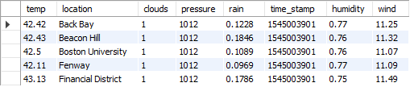
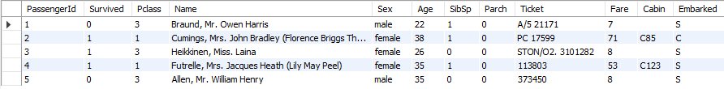
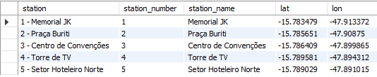
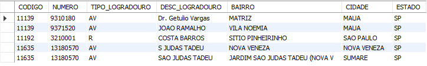
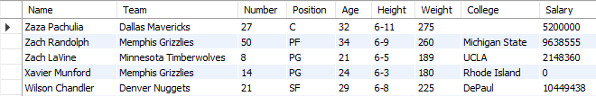
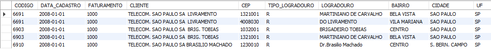
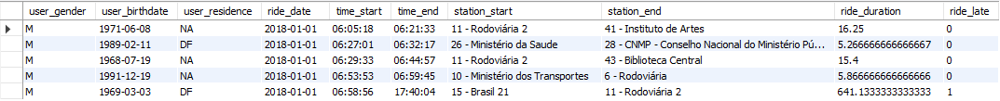

# Data Ingestion

## Introduction
The objective of this project is to ingest data from 7 CSV files into 7 different tables in the database.

For this project I used Python with the libraries: mysql.connector and csv.

## Prerequistes

- Create database: MAESTRIADADOS;

- Create tables:
    - WEATHER
    - TITANIC
    - STATIONS
    - ENDERECOS
    - NBA_PLAYERS
    - CLIENTES
    - RIDES

SQL Script to create tables in the folder `sql/`.

## Tables
WEATHER

TITANIC

STATIONS

ENDERECOS

NBA_PLAYERS

CLIENTES

RIDES

## Contact
> Author: Gabriel Pedrosa

> Role: Data Engineer

